# 📡 Handlers de Comunicação

Guia prático para usar e estender handlers.

## Uso Rápido - LoRaHandler

```cpp
#include "LoRaHandler.h"

HardwareSerial loraSerial(1);

LoRaConfig cfg = {
    .serial = &loraSerial,
    .appEUI = (const uint8_t*)APPEUI,
    .appKey = (const uint8_t*)APPKEY,
    .useConfirmation = false,
    .useADR = true,
    .fixedDR = 5,
    .joinTimeout = 30000,
    .confirmTimeout = 6000,
    .maxRetries = 3
};

LoRaHandler handler(cfg);

void setup() {
    handler.begin();
    handler.connect();  // OTAA Join
}

void loop() {
    handler.process();  // Atualizar estado
    
    if (handler.isConnected()) {
        uint8_t payload[] = {0x01, 0x02, 0x03};
        SendResult result = handler.send(1, payload, 3);
        
        if (result == SendResult::SUCCESS) {
            if (handler.isConfirmed()) {
                Serial.println("ACK recebido");
            }
        }
    }
    
    delay(100);
}
```

---

## Métodos Disponíveis

### LoRaHandler

```cpp
// Inicialização
bool begin()                          // Inicializar module LoRa
void end()                            // Finalizar

// Conexão
bool connect()                        // OTAA Join
bool isConnected()                    // Verificar conexão
ConnectionState getConnectionState()  // Obter estado

// Envio/Recebimento
SendResult send(uint8_t port, const uint8_t* data, uint16_t len)
bool isConfirmed()                    // Verificar ACK
ReceiveResult receive(DownlinkMessage& msg)

// Configuração
bool setConfirmation(bool enabled)    // Habilitar CFM
bool setADR(bool enabled)             // Habilitar ADR
bool setDataRate(uint8_t dr)          // Data Rate fixo
bool getDevEUI(char* buffer)          // Ler DevEUI

// Processamento
void process()                        // Chamável em loop()
const char* getStateString()          // Descrição do estado
```

---

## Estados e Enumerações

### ConnectionState

```cpp
ConnectionState::DISCONNECTED        // Não conectado
ConnectionState::CONNECTING          // Tentando OTAA
ConnectionState::CONNECTED           // Pronto
ConnectionState::WAITING_CONFIRMATION// Aguardando ACK
ConnectionState::ERROR               // Erro
```

### SendResult

```cpp
SendResult::SUCCESS          // OK
SendResult::PENDING          // Aguardando
SendResult::FAILED           // Falha
SendResult::NOT_CONNECTED    // Sem conexão
SendResult::INVALID_DATA     // Dados inválidos
```

### ReceiveResult

```cpp
ReceiveResult::MESSAGE_RECEIVED  // Mensagem recebida
ReceiveResult::NO_MESSAGE        // Sem mensagens
ReceiveResult::ERROR             // Erro
```

---

## Exemplo: WiFiHandler (Implementar)

```cpp
#include "WiFiHandler.h"

WiFiConfig cfg = {
    .ssid = "seu_ssid",
    .password = "sua_senha",
    .serverAddr = "seu.servidor.com",
    .serverPort = 8080,
    .connectTimeout = 10000,
    .sendTimeout = 5000
};

CommunicationHandler* handler = new WiFiHandler(cfg);
// Mesma interface que LoRaHandler!
handler->begin();
handler->connect();
handler->send(1, data, len);
```

---

## Exemplo: MockCommHandler (Testes)

```cpp
#include "MockCommHandler.h"

MockCommConfig cfg = {
    .joinDelay = 1000,
    .sendDelay = 500,
    .confirmDelay = 1500,
    .confirmEnabled = true,
    .errorRate = 0  // 0% de erros
};

CommunicationHandler* handler = new MockCommHandler(cfg);
handler->begin();
handler->connect();

// Simular downlink para testes
DownlinkMessage msg = {.port = 10, .length = 3};
msg.data[0] = 0xAA;
handler->simulateDownlink(msg);
```

---

## Adicionar Novo Handler

### 1. Criar Header

```cpp
// include/MyHandler.h
#ifndef _MY_HANDLER_H
#define _MY_HANDLER_H

#include "CommunicationHandler.h"

struct MyConfig {
    // Seus parâmetros
};

class MyHandler : public CommunicationHandler {
private:
    MyConfig config;
    ConnectionState currentState;
    
public:
    explicit MyHandler(const MyConfig& cfg);
    ~MyHandler() override = default;
    
    bool begin() override;
    bool connect() override;
    SendResult send(uint8_t port, const uint8_t* data, uint16_t length) override;
    // ... implementar todos os métodos
};

#endif
```

### 2. Implementar

```cpp
// src/MyHandler.cpp
#include "MyHandler.h"

MyHandler::MyHandler(const MyConfig& cfg)
    : config(cfg),
      currentState(ConnectionState::DISCONNECTED) {}

bool MyHandler::begin() {
    LOGI("MyHandler", "Inicializando...");
    return true;
}

bool MyHandler::connect() {
    LOGI("MyHandler", "Conectando...");
    currentState = ConnectionState::CONNECTED;
    return true;
}

SendResult MyHandler::send(uint8_t port, const uint8_t* data, uint16_t length) {
    LOGI("MyHandler", "Enviando %d bytes na porta %d", length, port);
    return SendResult::SUCCESS;
}

// ... implementar resto dos métodos
```

### 3. Usar na Aplicação

```cpp
#include "MyHandler.h"

MyConfig cfg = { /* ... */ };
CommunicationHandler* handler = new MyHandler(cfg);

// Mesma interface!
handler->begin();
handler->connect();
handler->send(1, data, len);
```

---

## Diagrama - Fluxo Típico

```mermaid
flowchart TD
    A["setup()"] --> B["handler.begin()"]
    B --> C["handler.connect()"]
    C --> D{Conectado?}
    D -->|Não| E["Retry"]
    E --> C
    D -->|Sim| F["loop()"]
    F --> G["Ler sensores"]
    G --> H["handler.send()"]
    H --> I["handler.process()"]
    I --> J{"Confirmar?"}
    J -->|Sim| K["handler.isConfirmed()"]
    K --> L["Próximo ciclo"]
    J -->|Não| L
    L --> F
```


