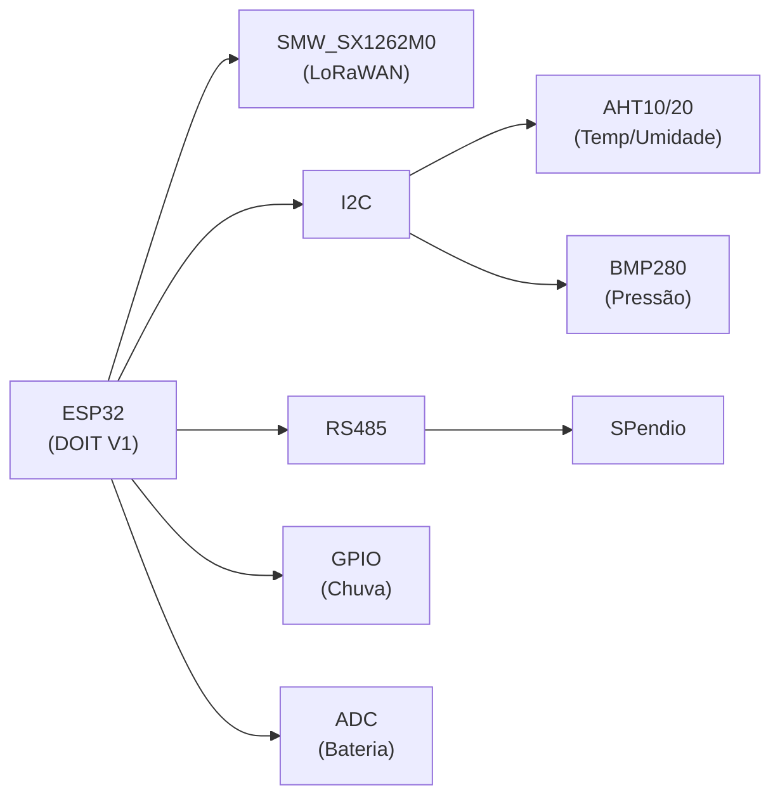

# 📡 Pendio - Monitoramento de Taludes com LoRaWAN

Este repositório contém o firmware para o sistema de monitoramento de taludes e encostas "Pendio", baseado na placa Wemos D1 R32 (ESP32) e no módulo LoRaWAN Robocore (SMW_SX1262M0).

---

## 📝 Sobre o Projeto

O sistema realiza a leitura de diversos sensores e envia os dados consolidados via rede LoRaWAN.

- **Versão do SW**: WRCPendio Wemos Robocore CPendio (10/01/2024)
- **Autores**: Eng. Nuncio Perrella, MSc e Arnaldo

---

## ⚡ Hardware Principal

- **MCU**: Wemos D1 R32 (ESP32)
- **LoRaWAN**: Módulo Robocore SMW_SX1262M0
- **Sensores**:
    - Sensores SPendio (comunicação RS485)
    - Sensor de Temp/Umidade (AHT10/AHT20)
    - Sensor de Pressão/Temp (BMP280)
    - Sensor de Chuva (Contacto seco)
    - Monitor de Bateria (Divisor de tensão)



Para um detalhamento completo do mapeamento de pinos, consulte [➡️ docs/HARDWARE.md](docs/HARDWARE.md).

A descrição completa do formato da mensagem enviada via LoRaWAN está documentada em [➡️ docs/PROTOCOLO.md](docs/PROTOCOLO.md).

--- 

## 📁 Estrutura

```
PendioServidor/
├── include/           # Headers (.h)
├── src/               # Implementações (.cpp)
├── lib/               # Bibliotecas externas
├── docs/              # HARDWARE, PROTOCOLO
├── README.md          # Este arquivo
├── QUICK_START.md     # Primeiros passos
├── ARCHITECTURE.md    # Design de handlers
├── HANDLERS.md        # Guia de implementação
└── INTEGRATION_CHECKLIST.md
```

---

## 📖 Documentação

| Arquivo | Informações |
|---------|---------|
| [**docs/ARCHITECTURE.md**](./docs/ARCHITECTURE.md) | Entender o design |
| [**docs/HANDLERS.md**](./docs/HANDLERS.md)| Usar/estender handlers |
| [**docs/HARDWARE.md**](./docs/HARDWARE.md)| Pinos e conexões |
| [**docs/PROTOCOLO.md**](./docs/PROTOCOLO.md) | Formato de mensagens |

---

## 👾 Upload do Projeto 

Instale o Visual Studio Code com a extensão PlatformIO e clone este repositório:

```bash
git clone https://github.com/Nyfeu/PendioServidor.git
```

Crie o ficheiro `include/credentials.h` com as chaves LoRaWAN corretas (ver `include/credentials.h.exemplo`).

Use o ambiente PIO (PlatformIO) para compilar e gravar o firmware no hardware.

```bash
git clone https://github.com/Nyfeu/PendioServidor.git
cd PendioServidor
cp include/credentials.example.h include/credentials.h
# Editar include/credentials.h com suas chaves LoRa
platformio run                  # Compilar
platformio run --target upload  # Upload
platformio device monitor       # Monitor Serial
```

---

## 🧾 Histórico de Instalações e Gravações

| Unidade | Descrição |
|---------|-----------|
| Pendio 1 | Sistema de Testes POLI Civil - Kaiene |
| Pendio 2 | Caixa de testes - Geólogos _ Igor |
| Pendio 3 | Arnaldo |
| Pendio 4 | USP |
| Pendio 5 | A ser instalado |
| Pendio 6 | A ser instalado (Teste Nuncio 14/11/2024) |
| Pendio 7 | Raia Olimpica USP |
| Pendio 8 | Raia Olimpica USP |
| Pendio 9 | Sensor 14/11/2024 |

## 🗝️ Chaves LoRaWAN (AppEUI e AppKey)

O histórico das chaves pode ser consultado em [➡️ docs/CHAVES.md](docs/CHAVES.md).

Os valores de: `AppEUI`e `AppKey` deve ser atualizado em `include\credentials.h` seguindo:
```c
#ifndef _CREDENTIALS_H
#define _CREDENTIALS_H

const char APPEUI[] = "Valor do AppEUI aqui";
const char APPKEY[] = "Valor do AppKEY aqui";

#endif /* _CREDENTIALS_H */
```

Conforme está em `include\credentials.example.h`. O passo a passo para a configuração:
1. Copiar para `include\credentials.h`
2. Substituir os valores corretos

--- 
