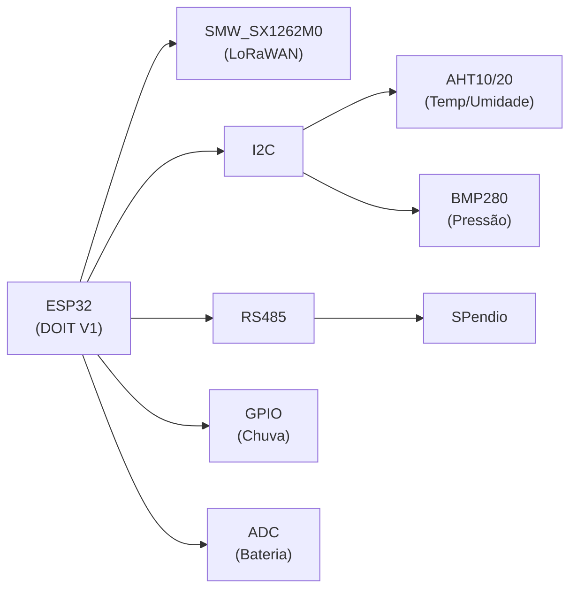

# 📡 Pendio - Monitoramento de Taludes com LoRaWAN

Firmware profissional para **ESP32 + LoRaWAN** com logging estruturado, sensores ambientais e comunicação modular.

**Versão**: v2.0 (Refatorado)  
**Autores**: Eng. Nuncio Perrella, MSc e Arnaldo  
**Data**: Abril 2025

---

## 🚀 Quick Start

```bash
git clone https://github.com/Nyfeu/PendioServidor.git
cd PendioServidor
cp include/credentials.example.h include/credentials.h
# Editar include/credentials.h com suas chaves LoRa
platformio run                  # Compilar
platformio run --target upload  # Upload
platformio device monitor       # Monitor Serial
```

Veja **QUICK_START.md** para instruções detalhadas.

---

## ⚡ Hardware



| Componente | Interface | Função |
|-----------|-----------|--------|
| **AHT10/20** | I2C | Temperatura/Umidade |
| **BMP280** | I2C | Pressão atmosférica |
| **SPendio** | RS485 Modbus | Sensores customizados |
| **Rain Gauge** | GPIO | Contador de chuva |
| **Bateria** | ADC | Monitoramento de tensão |

Detalhes em **docs/HARDWARE.md**.

---

## 📁 Estrutura

```
PendioServidor/
├── include/           # Headers (.h)
├── src/               # Implementações (.cpp)
├── lib/               # Bibliotecas externas
├── docs/              # HARDWARE, PROTOCOLO
├── README.md          # Este arquivo
├── QUICK_START.md     # Primeiros passos
├── ARCHITECTURE.md    # Design de handlers
├── HANDLERS.md        # Guia de implementação
└── INTEGRATION_CHECKLIST.md
```

---

## 📖 Documentação

| Arquivo | Para... |
|---------|---------|
| **QUICK_START.md** | Começar em 5 min |
| **ARCHITECTURE.md** | Entender o design |
| **HANDLERS.md** | Usar/estender handlers |
| **docs/HARDWARE.md** | Pinos e conexões |
| **docs/PROTOCOLO.md** | Formato de mensagens |
| **BUILD_FIX_SUMMARY.md** | Histórico de correções |

---

## 🔧 Principais Features

✅ **Logging Profissional**: Timestamps, níveis, tags estruturadas  
✅ **LoRaHandler**: OTAA Join, CFM, ADR, Data Rate configurável  
✅ **Sensores Integrados**: AHT, BMP280, RS485, Chuva, Bateria  
✅ **Arquitetura Modular**: Padrão Strategy para fácil extensão  
⏳ **WiFiHandler**: Estrutura pronta para implementação  
⏳ **MockCommHandler**: Testes sem hardware  

---

## ✅ Status da Compilação

```
RAM:   6.8%  (22,420 / 327,680 bytes)
Flash: 24.8% (325,273 / 1,310,720 bytes)
```

**Build**: ✅ SUCCESS  
**Logger**: ✅ Implementado  
**LoRaHandler**: ✅ Completo  
**Sensores**: ✅ Integrados  

---

## 📱 Exemplo de Uso

```cpp
#include "LoRaHandler.h"
#include "Logger.h"

LoRaHandler handler(loraConfig);

void setup() {
    Logger::begin(115200);
    handler.begin();
    handler.connect();  // OTAA Join
    LOGI("SYSTEM", "Sistema pronto");
}

void loop() {
    handler.process();
    
    if (handler.isConnected()) {
        uint8_t data[] = {0x01, 0x02, 0x03};
        SendResult result = handler.send(1, data, 3);
        
        if (result == SendResult::SUCCESS) {
            LOGI("COMM", "Dados enviados com sucesso");
        }
    }
    
    delay(1000);
}
```

Mais exemplos em **docs/USAGE_EXAMPLES.md**.

---

## 🔑 Configuração

### Credenciais LoRa (include/credentials.h)

```cpp
const char APPEUI[] = "seu_appeui_aqui";
const char APPKEY[] = "sua_appkey_aqui";
```

### Timeout e Retries (include/config.h)

```cpp
#define JOIN_TIMEOUT_VALUE 30000    // 30s
#define CFM_TIMEOUT_VALUE 6000      // 6s
```

---

## 🛠️ Troubleshooting

| Problema | Verificar |
|----------|-----------|
| Erro ao compilar | `platformio.ini` e dependências |
| LoRa não conecta | Credenciais em `credentials.h` |
| Sem logs | Baudrate Serial (115200) |
| Sensor não responde | Conexão I2C/RS485 |

---

## 📚 Aprender Mais

1. Leia **QUICK_START.md** para começar
2. Veja **ARCHITECTURE.md** para entender o design
3. Estude **HANDLERS.md** para implementar extensões
4. Consulte **docs/USAGE_EXAMPLES.md** para exemplos práticos

---

**Autor**: Eng. Nuncio Perrella, MSc  
**Licença**: Copyright (c) 2025
